# APITechnicalTest

Documentacion tecnica para prueba tecnica

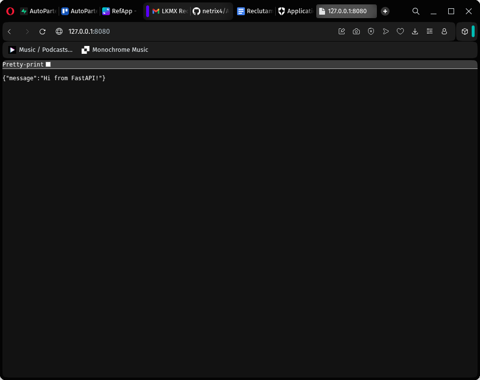
"/" del api creado en esta prueba tecnica

## Requisitos e instalacion

Como primer requisito previo para la utilizacion de este proyecto es necesario la creacion de un ambiente virtual de python3 con el comando

`python3 -m venve "ruta-del-venv"`

Posteriormente la instalacion de dependencia mediante el archivo de dependencia y el manejador de paquetes pip

`pip install -r dependecies.txt`

## Variables de entorno

Variables privada de entorno necesarias para poder usar el API y la base de datos (SQLite)

| Nombre de variable  | Descripcion                                             |
| ------------------- | ------------------------------------------------------- |
| AUTH0_DOMAIN        | Dominio de la api de autenticacion                      |
| AUTH0_CLIENT_ID     | Identificador de cliente del api de autetificacion      |
| AUTH0_CLIENT_SECRET | Cadena secreta de proteccion de la api de autenticacion |
| AUTH0_AUDIENCE      | Identifacdor del destinatario del token de autorizacion |
| DATABASE_URL        | Ruta (en este caso fisica) del archivo de SQLite        |

## Uso

Previo a la isntalacion de requisitos de dependencias asi como la adquisision de valores para las varaibles de entorno. es necesario usar el comando `uvicorn main:app --reload --port 8080` en el directorio `app/` para evitar conflictos de puertos previamente no cerrados. Teniendo el proyecto corriendo podemos proceder al siguiente punto.

### Rutas

Se implemento proteccion de rutas mediante los servicios de Auth0 teniendo como resultado las siguientes divisiones

#### Publicas

`/` o Inicio

Esta es la ruta principal del api

`/public/products/`

Aqui se listan los productos
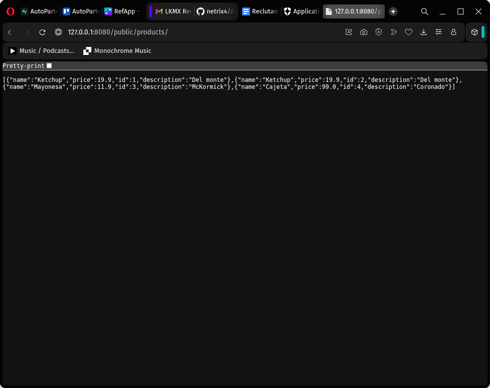

`/public/products/quantity`

Endpoint de agregacion que devuelve la cantidad total de productos
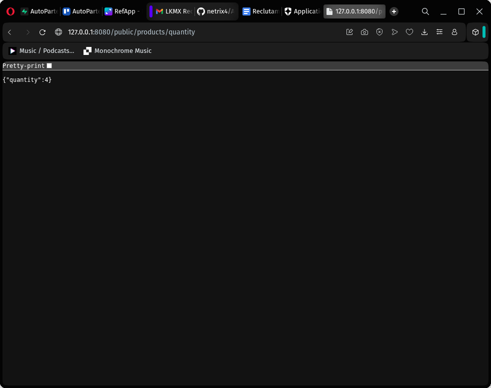

`/products/{id}`

Endpoint de consulta de un producto por id
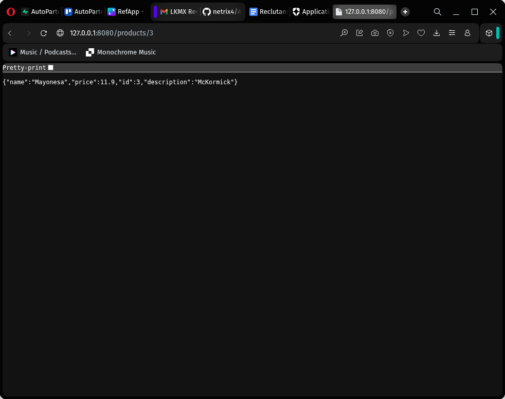

`/get-token/`

Endpoint temporal para poder obtener un token y hacer uso de los endpoint privados
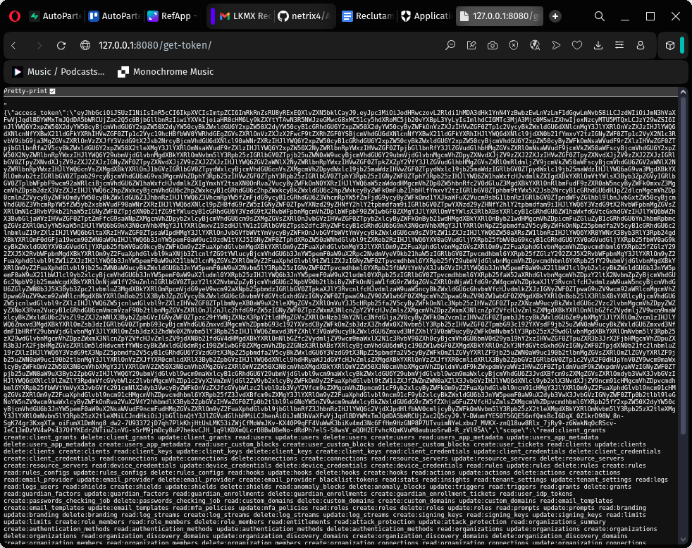

`/products/` (POST)
Endpoint para agregar un producto nuevo (enviado en el body), retornando el producto recien argegado
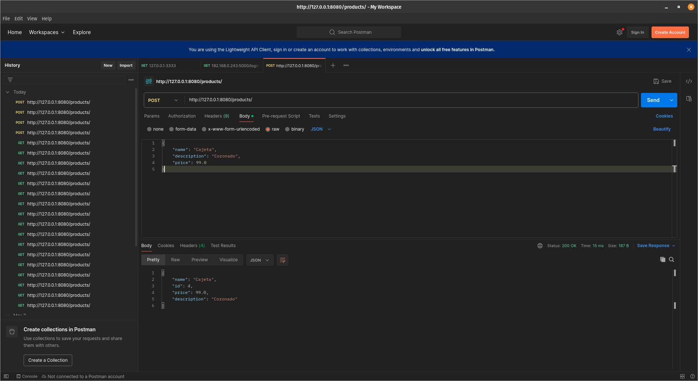

#### Protegidas

`/products/`

Endpoint privado para consulta solo con autentificacion previa (Bearer token requerido)
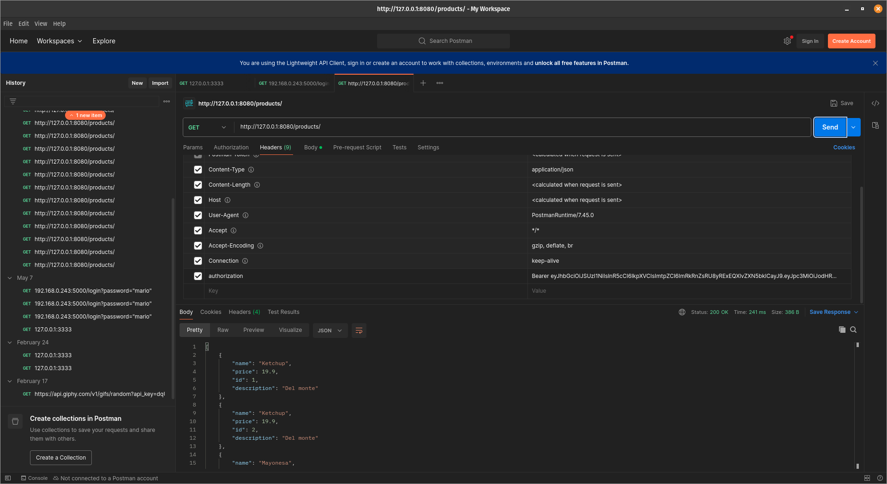

## Configuracion de Auth0

Esta fue la configuracion asignada a la aplicacion de Auth0
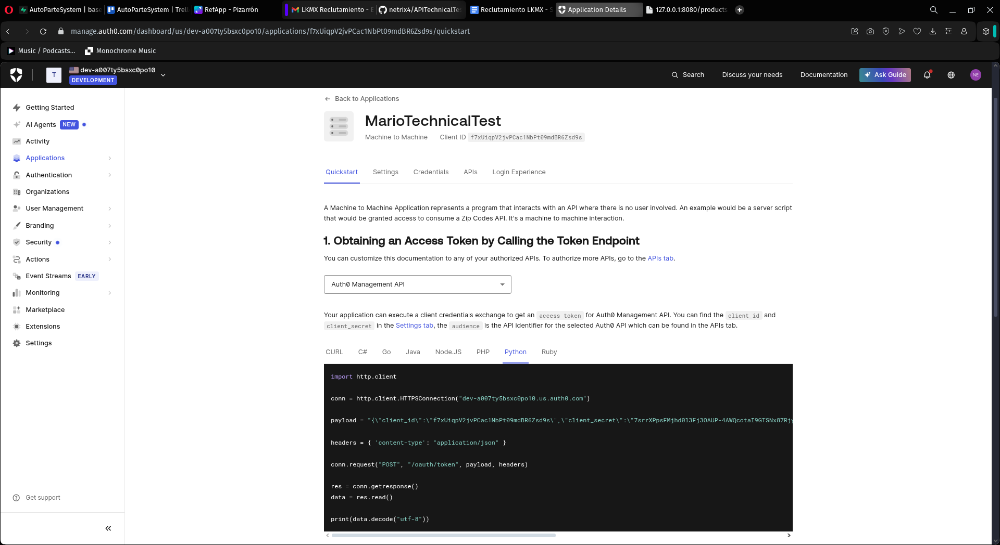

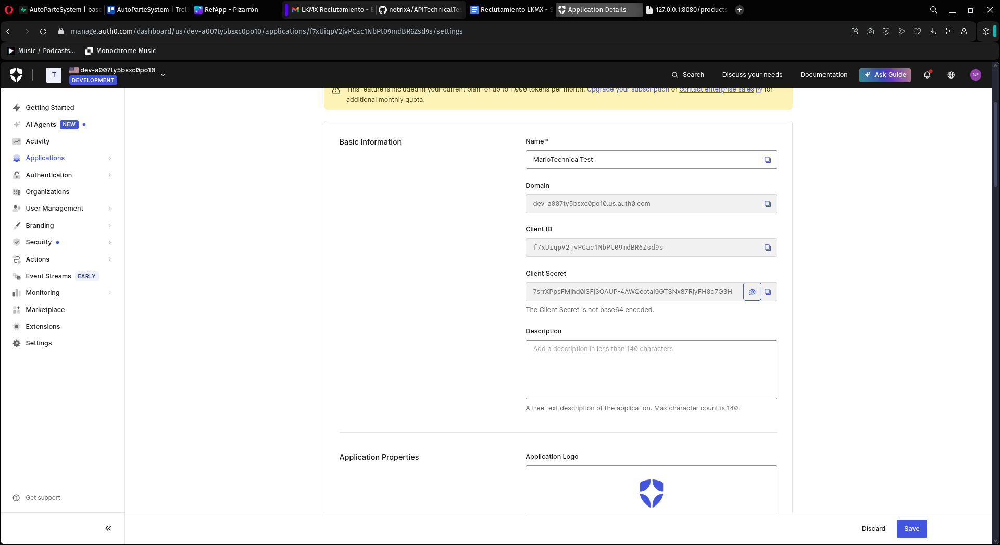

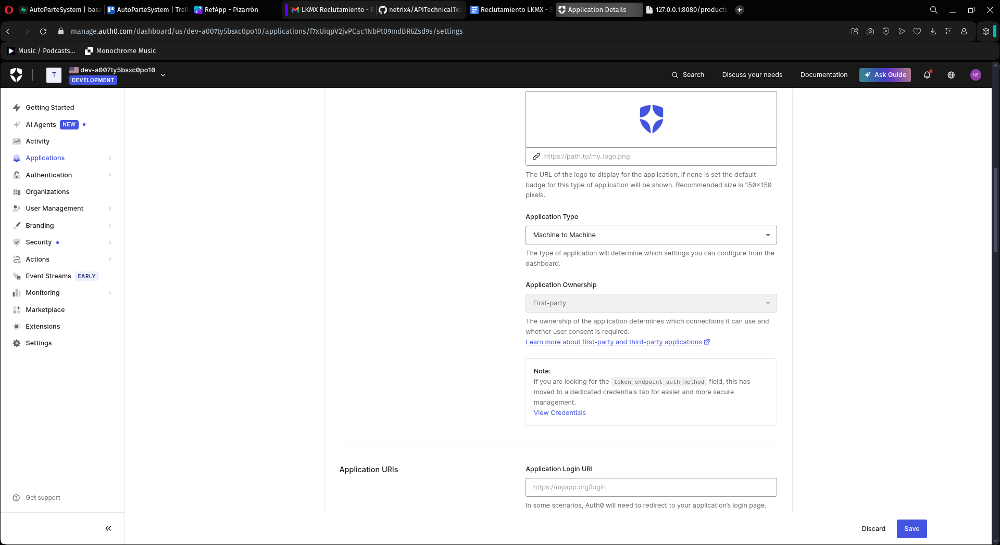

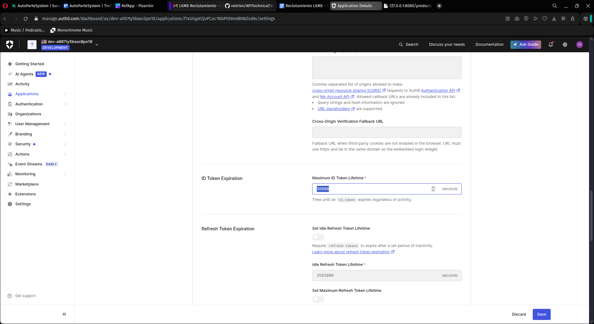

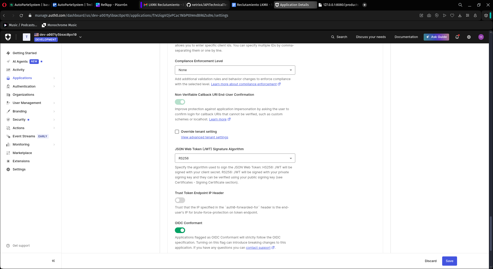

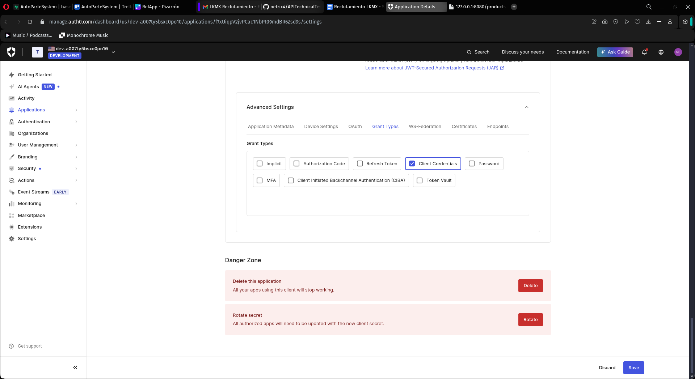

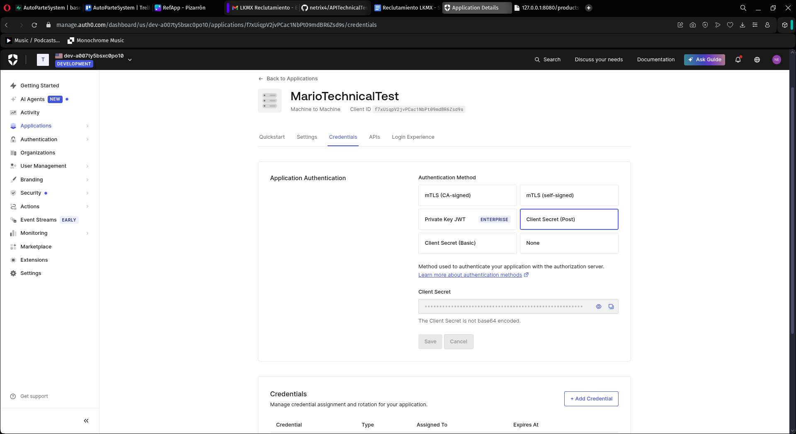

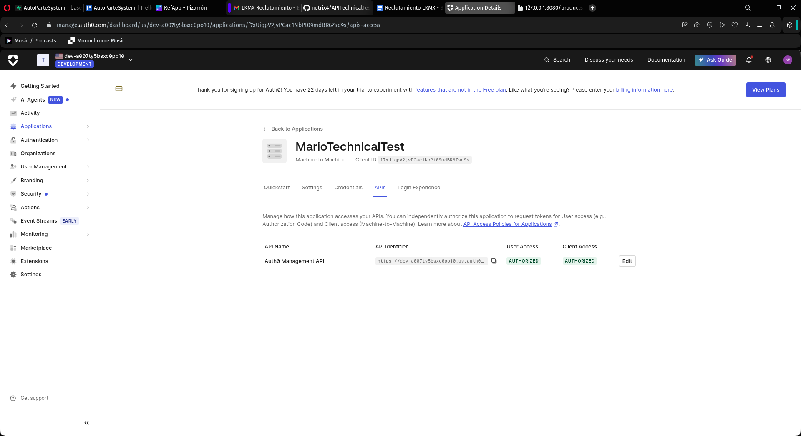

## Migracion de Base de Datos

Como se puede ver en las dependencias se implemento Alchemic para migracion de base de datos mapeando modelos con tablas. Resultando en la siguiente evidencia

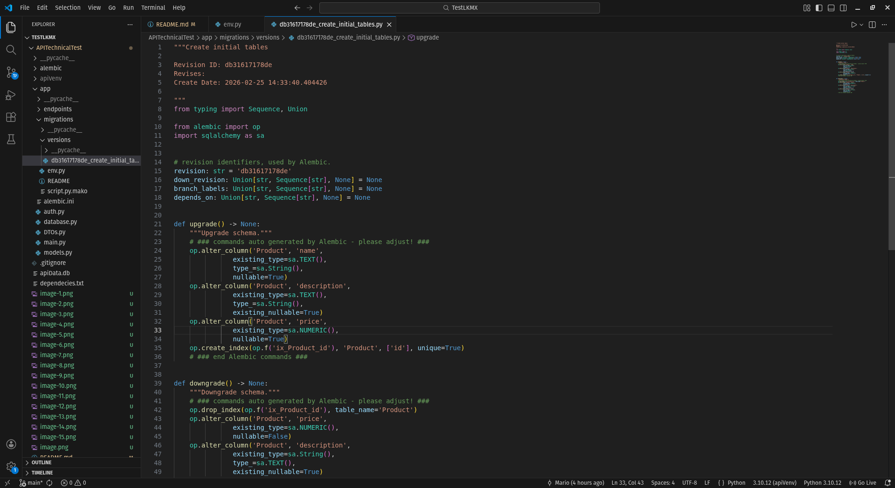
